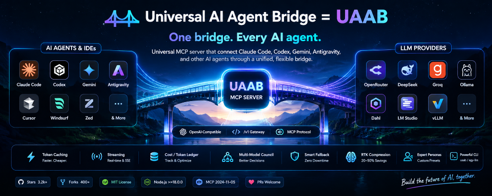

# 🌉 Universal AI Agent Bridge = UAAB

One bridge. Every AI agent. 

Universal MCP server that connect  Claude Code, Codex, Gemini, Antigravity, and other
AI agents through a unified, flexible bridge.

<p align="center">
  
</p>

<p align="center">
  <a href="https://github.com/libragik/universal-llm-bridge/stargazers"></a>
  <a href="https://github.com/libragik/universal-llm-bridge/network/members"></a>
  <a href="https://opensource.org/licenses/MIT"></a>
  <a href="https://nodejs.org/"></a>
  <a href="https://modelcontextprotocol.io/"></a>
  <a href="https://github.com/libragik/universal-llm-bridge/pulls"></a>
</p>

<p align="center">
  <b>Connect ANY AI Agent (Claude Code, Cursor, Windsurf, Codex, Gemini, Antigravity) to ANY OpenAI-compatible /v1 endpoint in the universe.</b><br>
  Zero npm dependencies. 15ms cold start. Auto rate-limit failover. 0ms semantic caching. Real-time cost ledger. Multi-model AI council consensus.
</p>

---

## 📑 Table of Contents

- [⚡ 30-Second Quickstart for Every Agent](#-30-second-quickstart-for-every-agent)
  - [Claude Desktop](#1-claude-desktop)
  - [Claude Code CLI](#2-claude-code-cli)
  - [Cursor & Windsurf](#3-cursor--windsurf)
  - [Google Antigravity Desktop](#4-google-antigravity-desktop)
  - [Standalone Terminal CLI](#5-standalone-terminal-cli)
- [🔥 Why UAAB? (Comparison Matrix)](#-why-uaab-comparison-matrix)
- [🏗️ Multi-Agent Architecture](#️-multi-agent-architecture)
- [✨ 8 Unbeatable Superpowers](#-8-unbeatable-superpowers)
- [🔌 Supported Providers Matrix](#-supported-providers-matrix)
- [🛠️ MCP Tools Reference](#️-mcp-tools-reference)
- [💻 CLI Reference (`uaab` / `agy-llm`)](#-cli-reference-uaab--agy-llm)
- [🔒 Security & Zero-Leakage Privacy](#-security--zero-leakage-privacy)
- [🤝 Contributing](#-contributing)
- [📜 License](#-license)

---

## ⚡ 30-Second Quickstart for Every Agent

### 1. Claude Desktop
Add to your `claude_desktop_config.json` (`%APPDATA%\Claude\claude_desktop_config.json` on Windows or `~/Library/Application Support/Claude/claude_desktop_config.json` on macOS):

```json
{
  "mcpServers": {
    "universal-ai-agent-bridge": {
      "command": "node",
      "args": ["<PATH_TO_REPO>/index.mjs"]
    }
  }
}
```

### 2. Claude Code CLI
Add UAAB with a single command:
```bash
claude mcp add universal-ai-agent-bridge node <PATH_TO_REPO>/index.mjs
```

### 3. Cursor & Windsurf
In **Settings > Features > MCP**:
- **Name**: `universal-ai-agent-bridge`
- **Type**: `command`
- **Command**: `node <PATH_TO_REPO>/index.mjs`

### 4. Google Antigravity Desktop
Run the automated 1-click setup script:
- **Windows**:
  ```powershell
  powershell -ExecutionPolicy Bypass -File .\setup.ps1
  ```
- **macOS / Linux**:
  ```bash
  chmod +x setup.sh && ./setup.sh
  ```

### 5. Standalone Terminal CLI
Use UAAB directly from your favorite terminal without any editor or host agent:
```bash
# Link globally
npm link

# Test active provider
uaab active
uaab test

# Run a query with streaming
uaab ask "Explain quantum annealing in 3 bullet points" --stream

# Convene multi-model AI council
uaab council "Should we use PostgreSQL or Redis for high-frequency locks?"
```

---

## 🔥 Why UAAB? (Comparison Matrix)

| Feature | Raw API Keys | Standard MCP Servers | LiteLLM Proxy | **Universal AI Agent Bridge (UAAB)** |
| :--- | :---: | :---: | :---: | :---: |
| **Agent Support** | ❌ Manual code | ⚠️ 1 Agent at a time | ⚠️ HTTP daemon needed | ✅ **Universal (Claude, Cursor, Codex, Gemini, Antigravity)** |
| **Zero Dependencies** | ❌ | ⚠️ Heavy npm packages | ❌ Heavy Python pip | ✅ **100% Pure Native Node.js ESM** |
| **Cold Start Latency** | N/A | ~500ms - 2s | ~1.5s - 3s | ⚡ **< 15ms Instant Boot** |
| **Zero-Downtime Cascade** | ❌ Fails on 429 | ❌ Hard crash | ⚠️ Complex YAML | ✅ **Built-in Auto-Failover (Dahl → Groq → DeepSeek → Local)** |
| **Local Engine Auto-Scan**| ❌ | ❌ | ❌ Manual config | ✅ **1-Click Port Scanner (Ollama, LM Studio, vLLM, 9Router)** |
| **Multi-Model Consensus** | ❌ | ❌ | ❌ | ✅ **AI Council Deliberation (`llm_council`)** |
| **Prompt Token Compressor**| ❌ Full cost | ❌ Full cost | ❌ | ✅ **RTK Engine (Saves 20% - 50% Input Tokens)** |
| **Deterministic Cache**   | ❌ | ❌ | ⚠️ External Redis | ✅ **Built-in SHA-256 0ms Cache** |
| **Real-Time Token Ledger**| ❌ | ❌ | ⚠️ Database required | ✅ **Built-in USD & Token Accounting** |

---

## 🏗️ Multi-Agent Architecture

```
 ┌─────────────────────────────────────────────────────────────────────────┐
 │               AI Agents & Environments (Claude / Codex / Gemini / AGY)  │
 │                                                                         │
 │   ┌───────────────┐     ┌───────────────┐    ┌──────────────────────┐   │
 │   │  Claude Code  │     │ Codex / Cursor│    │ Antigravity / Gemini │   │
 │   └───────┬───────┘     └───────┬───────┘    └──────────┬───────────┘   │
 └───────────┼─────────────────────┼───────────────────────┼───────────────┘
             │                     │                       │
             └─────────────────────┼───────────────────────┘
                                   │ JSON-RPC 2.0 over Stdio (MCP Protocol)
 ┌─────────────────────────────────▼───────────────────────────────────────┐
 │             Universal AI Agent Bridge - UAAB (MCP Server)               │
 │                                                                         │
 │  ┌───────────────────────┐   ┌──────────────────────────────────────┐   │
 │  │    Provider Vault     │   │   Adaptive Client & Engine           │   │
 │  │ (llm_providers.json)  │   │  (Chat, Fallback, Council, Cache)    │   │
 │  └───────────────────────┘   └──────────────────┬───────────────────┘   │
 └─────────────────────────────────────────────────┼───────────────────────┘
                                                   │
        ┌───────────────────┬──────────────────────┴────────┬──────────────────┐
        ▼                   ▼                               ▼                  ▼
 ┌──────────────┐    ┌──────────────┐                ┌──────────────┐   ┌──────────────┐
 │     Dahl     │    │  DeepSeek /  │                │ Local Router │   │ Local Offline│
 │  Inference   │    │  OpenRouter  │                │(FreeLLMAPI / │   │  (Ollama /   │
 │   Cluster    │    │  Groq / Mist │                │   9Router)   │   │  LM Studio)  │
 └──────────────┘    └──────────────┘                └──────────────┘   └──────────────┘
```

---

## ✨ 8 Unbeatable Superpowers

### 1. 🛡️ Zero-Downtime Smart Fallback Cascade
Never let a rate limit (`429`), concurrency spike, or cloud outage (`500/502/503`) abort your agent's task. If your primary provider fails or hits quota, UAAB automatically cascades across your fallback list (e.g. `dahl` → `groq` → `deepseek` → `openrouter` → `ollama`) and delivers the response seamlessly.

### 2. 🔍 Zero-Config Local Port Scanner (`llm_autodetect`)
Probes ports `11434` (Ollama), `1234` (LM Studio), `20128` (9Router/OmniRoute), `4000` (FreeLLMAPI), `8000` (vLLM), `8080` (LocalAI), and `1337` (Jan) in parallel under **100ms**. Discovers live loaded models and mounts them instantly into your active vault.

### 3. 📉 Smart Prompt Compression (RTK Token-Saver)
Compresses repetitive log polling lines, strips deep stack traces (like giant `node_modules` paths), and eliminates redundant indentation while strictly preserving syntactical meaning. **Slashes context costs by 20% to 50%.**

### 4. ⚖️ Multi-Model Council Consensus (`llm_council`)
Query multiple distinct LLM architectures in parallel (e.g., DeepSeek-R1 for chain-of-thought logic, MiniMax/Claude for structural code, Groq Llama-3.3 for lightning sanity check). An automated Chief Justice model analyzes candidate outputs, cross-examines discrepancies, flags subtle bugs, and synthesizes the final consensus verdict.

### 5. ⚡ 0ms Deterministic Response Cache (`llm_cache`)
Identical queries and repetitive code checks yield **instant 0ms responses** via canonical SHA-256 hashing. Includes configurable TTL and LRU eviction to maximize developer speed and eliminate wasted API spend.

### 6. 💰 Real-Time Token & Cost Ledger (`ledger.mjs`, `llm_get_analytics`)
Local persistent accounting logs exact prompt tokens, completion tokens, and dollar expenditures. Pre-configured rate cards for Dahl, DeepSeek, Groq, OpenRouter, and 100% free local models (Ollama/LM Studio).

### 7. 🌊 Live SSE Streaming with Token Velocity Telemetry
Built-in Server-Sent Events engine streams tokens in real-time, isolates `<think>` / `reasoning_content` deltas, and measures **Time-To-First-Token (TTFT)** and **tokens/sec velocity**.

### 8. 🎭 Expert Persona Presets Vault (`presets.mjs`)
Instant cognitive lens switching:
- `security-auditor`: Zero-trust code audits, injection detection, auth vulnerabilities.
- `systems-architect`: High-scale distributed architecture, CAP theorem analysis.
- `code-simplifier`: Clean code, cyclomatic complexity reduction, readability.
- `quant-trader`: Mathematical rigor, low-latency execution algorithms.
- Custom presets created easily via chat or CLI.

---

## 🔌 Supported Providers Matrix

| Category | Providers | Default Models |
| :--- | :--- | :--- |
| **High-Throughput Clusters** | [Dahl](https://inference.dahl.global/v1) | `MiniMaxAI/MiniMax-M2.7`, `deepseek-ai/DeepSeek-V4-Flash-0731`, `zai-org/GLM-5.3-Flash` |
| **Cloud Frontier APIs** | [DeepSeek](https://api.deepseek.com/v1), [Groq](https://api.groq.com/openai/v1), [OpenRouter](https://openrouter.ai/api/v1), [Cerebras](https://api.cerebras.ai/v1), [Together AI](https://api.together.xyz/v1) | `deepseek-chat`, `deepseek-reasoner`, `llama-3.3-70b-versatile`, `claude-3.7-sonnet` |
| **Local Multiplexers** | [FreeLLMAPI](https://github.com/tashfeenahmed/freellmapi), [9Router](http://localhost:20128/v1), [OmniRoute](http://localhost:20128/v1) | Any multiplexed model |
| **100% Offline Local Engines** | [Ollama](http://localhost:11434/v1), [LM Studio](http://localhost:1234/v1), [vLLM](http://localhost:8000/v1), [Jan](http://localhost:1337/v1) | `qwen2.5-coder:latest`, `deepseek-r1:latest`, `llama3.2` |

---

## 🛠️ MCP Tools Reference

Once connected, your AI agents have access to **14 built-in tools**:

| Tool | Purpose | Key Arguments |
| :--- | :--- | :--- |
| `llm_query` | Query any LLM with optional reasoning extraction | `prompt`, `system_prompt`, `model`, `provider`, `endpoint_url`, `api_key` |
| `llm_compare` | Benchmark answers from 2+ models side-by-side | `prompt`, `models`, `providers` |
| `llm_council` | Multi-model deliberation & synthesis | `prompt`, `members`, `synthesizer_model` |
| `llm_autodetect` | Scan localhost ports for running engines | None |
| `llm_compress_prompt` | Compress text to save input tokens | `text`, `aggressive` |
| `llm_list_models` | Query live available models from endpoint | `provider`, `endpoint_url`, `api_key` |
| `llm_test_connection` | Measure ping latency & validate keys | `provider`, `endpoint_url`, `api_key` |
| `llm_manage_providers`| Add, edit, remove, or switch providers | `action`, `key`, `name`, `base_url`, `api_key`, `model` |
| `llm_get_analytics` | Inspect token usage & USD costs | `timeframe`, `provider` |
| `llm_cache` | Inspect or flush response cache | `action`, `ttl_seconds` |
| `llm_presets` | List, use, or create expert personas | `action`, `name`, `system_prompt` |
| `llm_generate_image` | Generate images via `/v1/images/generations` | `prompt`, `model`, `size` |
| `llm_generate_video` | Generate video via `/v1/videos/generations` | `prompt`, `model`, `duration` |

---

## 💻 CLI Reference (`uaab` / `agy-llm`)

```text
Usage:
  uaab list                           List all configured providers in vault
  uaab active                         Show current active provider
  uaab set <provider_key>             Switch active default provider
  uaab test [provider_key]            Test connection & measure latency
  uaab models [provider_key]          Fetch live models list from provider
  uaab add <key> <url> [key] [model]  Add or update a provider endpoint
  uaab cascade [set prov1 prov2...]   Configure zero-downtime failover cascade
  uaab scan                           Auto-scan local ports for running AI engines
  uaab compress <text>                Compress prompt text & calculate savings
  uaab council [--members p1:m1,p2]   Convene multi-model AI council
  uaab ledger [clear]                 View token consumption & estimated USD costs
  uaab preset [list|show|add|del]     Manage expert personas & prompt presets
  uaab ask [--preset p] <prompt>      Quick test query using active provider
  uaab remove <provider_key>          Remove a provider from vault
```

---

## 🔒 Security & Zero-Leakage Privacy

- **100% Local-First**: UAAB runs entirely on your machine.
- **Zero Third-Party Telemetry**: No middleman server tracks your prompts, code, or tokens.
- **Direct Encrypted Transport**: All API requests travel directly between your machine and your designated base URL using TLS/HTTPS.
- **Safe Secrets Handling**: Provider keys in `llm_providers.json` and `.env` are automatically ignored by Git.

---

## 🤝 Contributing

Contributions make the open-source community an amazing place to learn, inspire, and create. Any contributions you make are **greatly appreciated**!

1. Fork the Project
2. Create your Feature Branch (`git checkout -b feature/AmazingFeature`)
3. Commit your Changes (`git commit -m 'Add some AmazingFeature'`)
4. Push to the Branch (`git push origin feature/AmazingFeature`)
5. Open a Pull Request

---

## 📜 License

Distributed under the **MIT License**. See [`LICENSE`](./LICENSE) for more information.

<p align="center">
  <b>Built with ❤️ for the Global AI & Agentic Developer Community.</b><br>
  <i>Universal AI Agent Bridge — One bridge. Every AI agent.</i>
</p>
